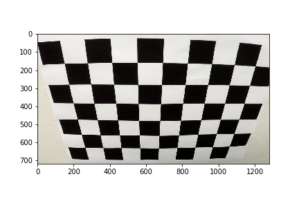
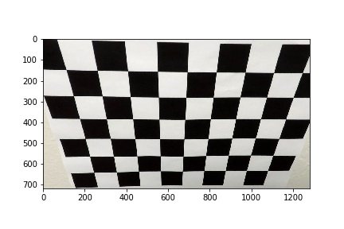
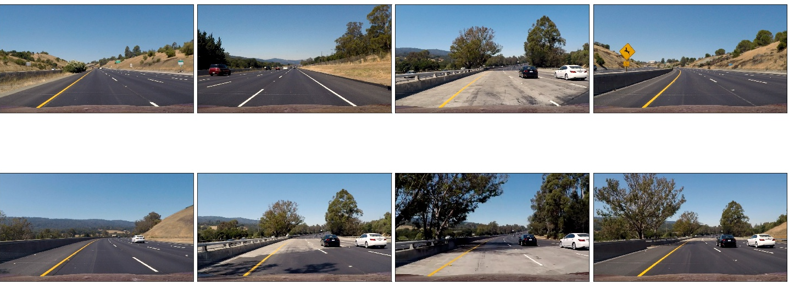
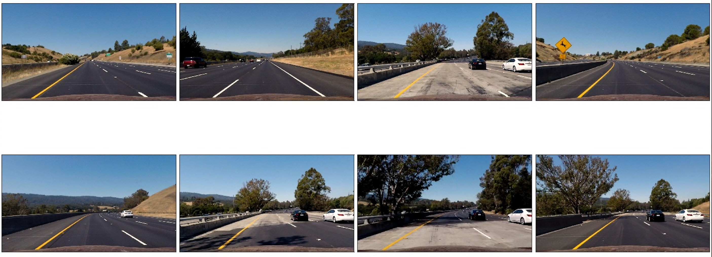
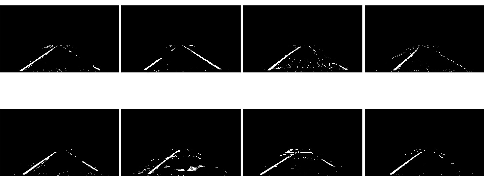
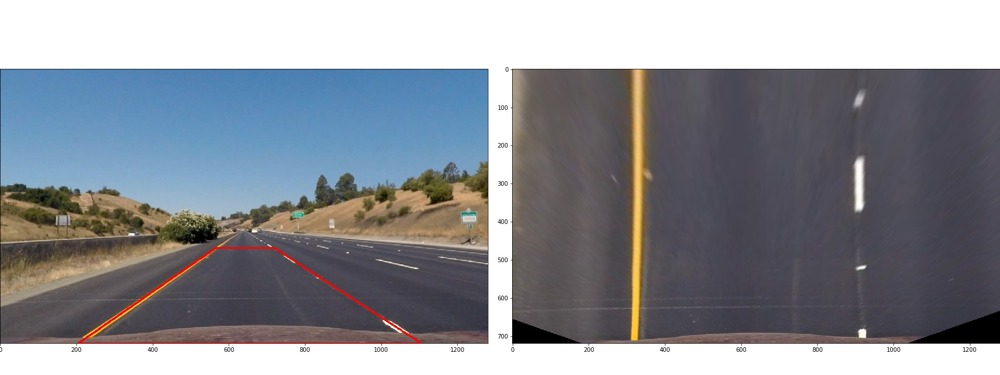
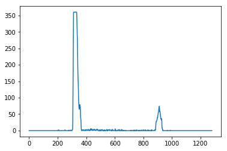
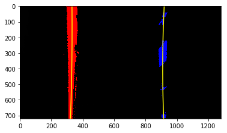
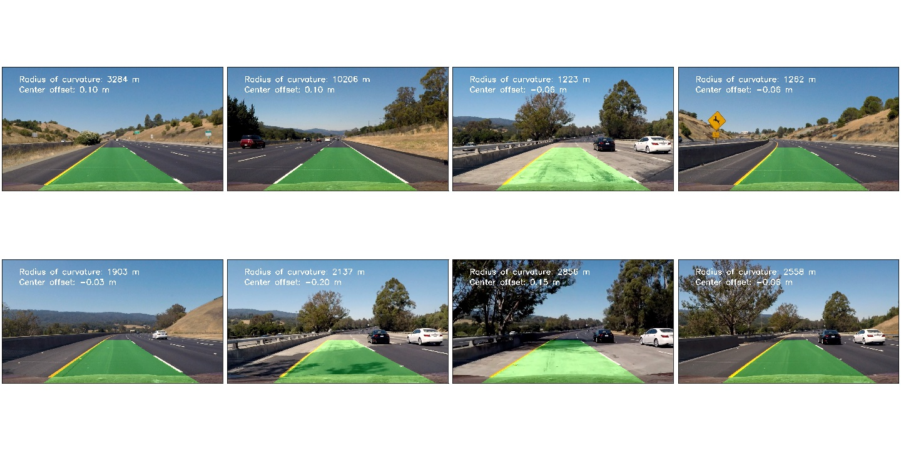

# Advanced Lane Finding

In this project, our goal is to write a software pipeline to identify the lane boundaries in a video. Major steps of this project are the following:

1. Camera calibration and image undistortion

2. Threshold image in various metrics (gradient, gradient angle, color space)

3. Perspective transform

4. Lane line pixel detection and Line Fitting

5. Calculation of curvature radius and car position to lane center

6. Output images with lane detection information

## Lane line Finding Pipeline

### I. Image Undistortion based on Camera Calibration

With the given chessboard images, we perform camera calibration. This step provides us the calibration matrix and distortion coefficients used for undistorting images. Below we demonstrate the correctness of the calibration as well as undistortion using image *calibration2.jpg* (On the left is the original image, and on the right is the undistorted image)

<table>
    <tr>
        <td></td>
        <td></td>
    </tr>
</table>

Below we can the undistortion of test images. Below is the original images. 

Following is the undistorted ones. 

### II. Obtain the Thresholded Binary Image

To facilitate detection of lane lines, we threshold gradient and different color channels. The main idea is threshold using various metrics. We select pixels satisfying $(g_angle & h_gradient) | (rg & l) | s$, 

* g_angle: gradient angle between ($\pi/4, \pi/2$] 
* h_gradient: gradient between (10, 200) 
* rg: R&G channel in RGB space between (180, 255)
* s: S channel in HLS space between (90, 255)
* l: L channel in HLS space between (155, 220)

The selection consists of three parts: (1) $(g_angle & h_gradient)$ for vertical lines detection; (2) (rg & l) for yellow and white color selection; and (3) $s$ for general pixel detection which is resilient to the light condition. 

### III. Perspective Transform

To perform a perspective transform, we manually select four vertices along the lane lines to form a polygon. We map these points to destination points depicting two parallel lines after the transformation. In this transformation, we obtain the transform matrix and its inverse, which can be respectively used to warp and unwarp images. 

### IV. Lane Line Pixel Detection and Fitting

Lane line pixel detection is based on ideas combined from following:
    
* Histogram peaks: Two lane lines are the two peaks in the bottom half of the histogram of a warped image

* Sliding window: X-value of adjacent/near Pixels in the same lane lines varies only slightly

On the left below is an exmaple showing histogram peaks. The overall algorithm works as below. We cut the image into 10 sub-images evenly in horizontal direction. Starting from the bottom sub-image we search for pixels of lane lines until we finish, which is known as sliding window. In each sub-image (sliding window), we search for pixels in the range ($x - margin, x+ margin$). Based on the found pixels, we may update the new $x$ values via the mean of pixels and continue the search in the next window. With this algorithm, we perform lane line detection and polynomial fitting as shown below on the right. 

<table>
    <tr>
        <td></td>
        <td></td>
    </tr>
</table>

### V. Curvature Radius and Car Position to Lane Center 

We perform the calculation of radius of curvature as discussed in the course. 

Car Position to Lane Center: The mean of the lane pixels at the image bottom minus the center of the image. 

### VI. Output Lane Info

* Warp the detected lane boundaries back onto the original image
* Output visual display of the lane boundaries and numerical estimation of lane curvature and vehicle position

## Results

### Discrete Images

Applying Pipeline to Discrete Images

The pipeline works well for all test images. 

## Videos

Besides the aforementioned, video pipeline did following more. 

* It performs the suggested optimization for searching lane line pixels, i.e., it searches pixels in the current image frame along the fitted lines from the previous ones. 

* It detect bad detection cases, like the detected lane lines are too close or too far, lane line is missing, or the curvature radius of the detected two lines differ too much. 
    
    * If this happens, in order to plot lane lines we use the average of old fitted lane lines
    
    * Once this happens, our search in the next frame adopts the original sliding-window algorithm for pixel finding; otherwise, the optimized way is adopted. 

* It average the last 10 fitted lane lines for smoothing the plotting in videos. 

The pipeline works well with [project_video.mp4](./output_videos/project_video.mp4). 

## Reflection

### Shortcomings

* Parameter setting, especially for thresholding image, is the most challenging part. Parameters scatters around the project, and it is hard to find the best parameter combination in a huge search space. 

* The pipeline does not deal with the challege videos well due to the strong/weak light, blurred lines, and sharp turns. 

### Improvement

* A more systematic and atuomatic way is needed for better parameter setting

* Varying strategies are needed for various road situation, like strong lights, blurred lines, and sharp turns. Like high-order polynomial fitting might help for sharp turns. Better pixel selection in S channel of HSL color space might be needed for strong/weak light condition. 